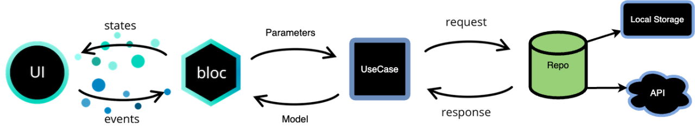
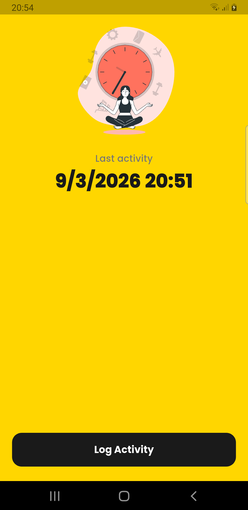
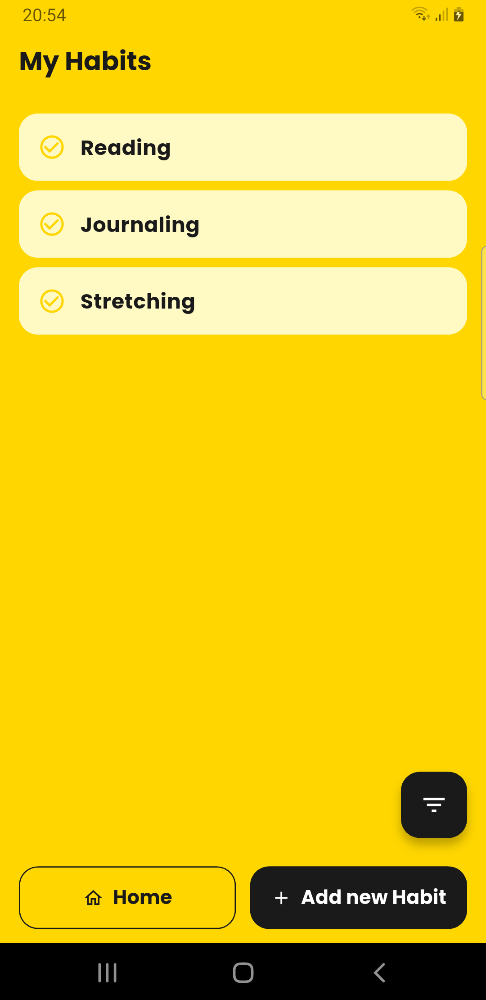
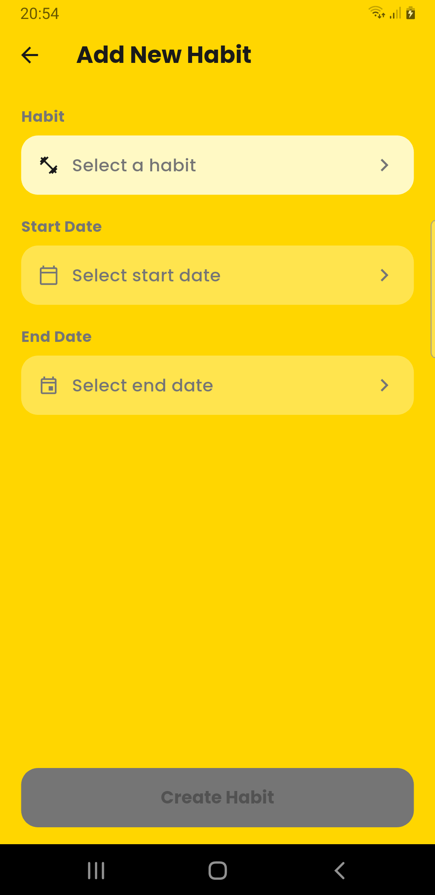
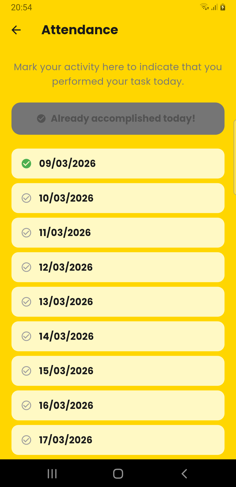

# Habit Tracker

A Flutter app to track productivity and healthy habits.

---

## Architecture

This project follows **Clean Architecture** with the **BLoC pattern** for state management.



### Layers

```
lib/
├── core/
│   ├── constants/       # AppStrings (i18n-ready)
│   ├── data/
│   │   ├── models/      # ObjectBox entities
│   │   └── repositories/
│   │       └── domain/  # Domain models (Habit, Attendance)
│   ├── di/              # GetIt dependency injection
│   ├── router/          # go_router route definitions
│   └── theme/           # AppColors, AppTheme
│
└── features/
    ├── home/
    ├── dashboard/
    ├── add_habit/
    └── habit_attendance/
        ├── domain/      # Enums, value objects
        ├── usecase/     # Business logic (one class per use case)
        └── presentation/
            ├── bloc/    # Events, States, BLoC
            ├── screen/  # Screens
            └── widgets/ # Reusable UI components
```

### Key decisions

| Concern | Choice |
|---|---|
| State management | `flutter_bloc` (single-state data class pattern) |
| Dependency injection | `get_it` — blocs as factory, shared blocs as lazy singleton |
| Navigation | `go_router` with path parameters |
| Local database | ObjectBox |
| Fonts | Poppins (bundled in `assets/fonts/`) |
| Strings | `AppStrings` abstract class — ready for `intl` localisation |

---

## Screenshots

| Home | Dashboard | Add Habit |
|---|---|---|
|  |  |  |

| Select Habit | Attendance |
|---|---|
|  |  |

---

## How to Run

### Prerequisites

- Flutter SDK `>=3.27.0`
- Android Studio or VS Code
- Android device or emulator (API 21+)

### Steps

```bash
# 1. Clone the repository
git clone <repo-url>
cd Habit-tracker

# 2. Install dependencies
flutter pub get

# 3. Run code generation (ObjectBox)
dart run build_runner build --delete-conflicting-outputs

# 4. Run the app
flutter run
```

### Build release APK

```bash
flutter build apk --release
```

> Ensure `android/key.properties` exists with your keystore credentials before building a release.
> See `android/app/build.gradle.kts` for signing configuration.
